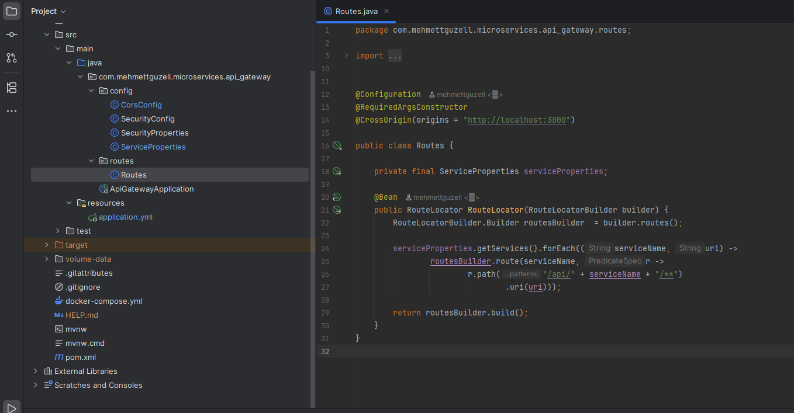

# API Gateway – Kod ve İşleyiş Açıklaması



## application.yml

```yaml
spring:
  application:
    name: api-gateway

server:
  port: 9000

services:
  services:
    product: http://localhost:8080
    order: http://localhost:8081
    inventory: http://localhost:8082
```

- **`spring.application.name`** → Uygulamanın adı (`api-gateway`).
- **`server.port`** → Uygulamanın çalışacağı port (`9000`).
- **`services.services`** → Mikroservislerin isim ve adresleri:
  - `product` → `http://localhost:8080`
  - `order` → `http://localhost:8081`
  - `inventory` → `http://localhost:8082`

> Bu yapı, API Gateway’in hangi servislere yönlendirme yapacağını belirler.

---

## ServiceProperties.java

```java
@Configuration
@ConfigurationProperties(prefix = "services")
@Getter @Setter
public class ServiceProperties {
    private Map<String, String> services;
}

```

- **`@Configuration`** → Bu sınıf Spring için bir **konfigürasyon sınıfı**dır.
- **`@ConfigurationProperties(prefix="services")`** → `application.yml` dosyasındaki `services:` başlığındaki ayarları bu sınıfa yükler.
- **`Map<String,String> services`** → Servis isimleri ve adreslerini saklar.
  - Key → servis adı (`product`, `order`, `inventory`)
  - Value → servis adresi (`http://localhost:8080` gibi)

> Yani bu sınıf, application.yml’deki servis bilgilerini Java tarafında erişilebilir hale getirir.

---

## ApiGatewayApplication.java

```java
@SpringBootApplication
@EnableConfigurationProperties(ServiceProperties.class)
public class ApiGatewayApplication {
	public static void main(String[] args) {
		SpringApplication.run(ApiGatewayApplication.class, args);
	}
}

```

- **`@SpringBootApplication`** → Bu uygulamanın bir Spring Boot uygulaması olduğunu belirtir.
- **`@EnableConfigurationProperties(ServiceProperties.class)`** → Spring’e `ServiceProperties` sınıfını aktif etmesini ve değerleri yüklemesini söyler.
- **`main` metodu** → Uygulama burada başlar.

---

## Routes.java

```java
@Configuration
@RequiredArgsConstructor
@CrossOrigin(origins = "http://localhost:3000")
public class Routes {

    private final ServiceProperties serviceProperties;

    @Bean
    public RouteLocator RouteLocator(RouteLocatorBuilder builder) {
        RouteLocatorBuilder.Builder routesBuilder = builder.routes();

        serviceProperties.getServices().forEach((serviceName, uri) ->
                routesBuilder.route(serviceName, r ->
                        r.path("/api/" + serviceName + "/**")
                         .uri(uri)));

        return routesBuilder.build();
    }
}

```

### Açıklama

1. **Sınıf seviyesinde anotasyonlar**
   - `@Configuration` → Konfigürasyon sınıfı olduğunu belirtir.
   - `@RequiredArgsConstructor` → `final` alanları otomatik constructor ile oluşturur.
   - `@CrossOrigin(origins="http://localhost:3000")` → Sadece frontend’den gelen isteklere izin verir (CORS).
2. **Bean tanımlaması**
   - `@Bean` → Metodun döndürdüğü nesne Spring tarafından yönetilir.
   - `RouteLocator` → API Gateway’in tüm yönlendirme kurallarını tutar.
   - `RouteLocatorBuilder builder` → Yeni route’lar oluşturmak için kullanılır.
3. **Route oluşturma**

```java
RouteLocatorBuilder.Builder routesBuilder = builder.routes();

```

- Yeni route listesi başlatılır.

```java
serviceProperties.getServices().forEach((serviceName, uri) ->
    routesBuilder.route(serviceName, r ->
        r.path("/api/" + serviceName + "/**")
         .uri(uri)));

```

- `serviceProperties.getServices()` → Map içindeki tüm servisleri alır.
- Her servis için:
  - Route oluşturulur (`routesBuilder.route`)
  - URL eşleşme kuralı (`r.path("/api/" + serviceName + "/**")`) belirlenir
  - İstek, doğru adrese yönlendirilir (`.uri(uri)`)

```java
return routesBuilder.build();

```

- Tüm route’lar RouteLocator nesnesi olarak döndürülür ve Spring container’a eklenir.

---

## İşleyiş Akışı

1. `application.yml` → Servis bilgilerini tanımlar.
2. `ServiceProperties` → Bu bilgileri Java’da kullanılabilir hale getirir.
3. `ApiGatewayApplication` → Spring uygulamasını başlatır ve ServiceProperties’i aktif eder.
4. `Routes` → Her servis için API Gateway route’larını oluşturur.
5. API Gateway gelen istekleri `/api/{servisAdi}/...` formatına göre ilgili mikroservise yönlendirir.
